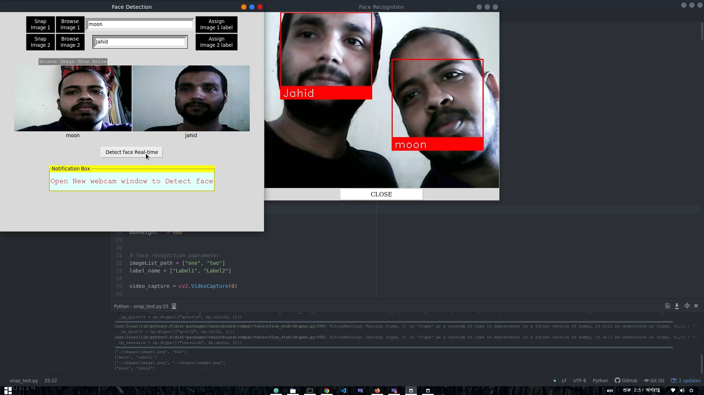

# Real-Time-Face-Recognition-App

## Introduction
A facial recognition system is a technology capable of identifying or verifying a person from a digital image or a video frame from a video source. There are multiple methods in which facial recognition systems work, but in general, they work by comparing selected facial features from given image with faces within a database. It is also described as a Biometric Artificial Intelligence based application that can uniquely identify a person by analyzing patterns based on the person's facial textures and shape.
In this project, I used the face_recognition library to recognize faces from anywhere anytime. Based on the face_recognition library and some python package bulti a desktop app that can recognize face in real-time

   
  <i>An example of Apps output.</i>

To real-time recognize any particular face of people, this app needs only one ground truth image of these particular people. You just need to fit the image to the app. There are three
way to fit the image. 

* **Way 1: Browse image directly from disk to recognize a face**
* **Way 2: Take image instantly by webcam to recognize a face**
* **Way 3: You can apply both this way simultaneously to recognize a face**

## How to use my code

* **for more to know click the image below(youtube video) **

## Dependencies:

* **python 3**
* **face_recognition**
* **Tensorflow**
* **Keras**
* **opencv (cv2)**
* **Numpy**
* **Pillow** 
